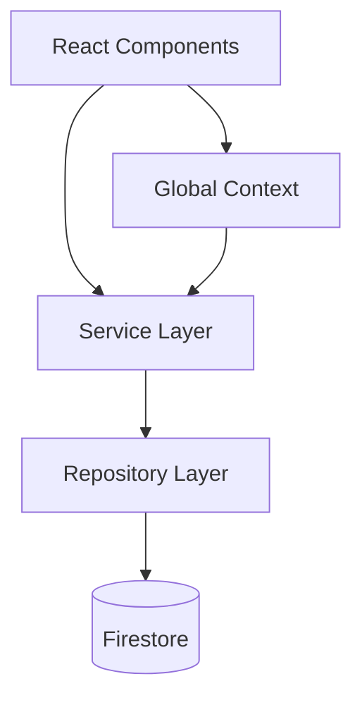

# Architecture: Ai-MaintenanceApp

## Executive Summary
The application follows a **Service-Repository Architecture** implemented within a **React 19** Modular Monolith. It is designed to run as a hybrid application: accessible via web browsers and as a standalone desktop application via Electron.

## Architecture Pattern: Service-Repository
The codebase allows for clear separation of UI concerns from business logic and data access.

### layers

1.  **Presentation Layer (`src/components`, `src/apps`, `src/pages`)**
    - Pure React components.
    - Responsible for rendering UI and handling user interactions.
    - **Rule**: Never accesses Firestore directly. Must use Services or Repositories.

2.  **Service Layer (`src/services`)**
    - Domain business logic (e.g., `inventoryService.js`).
    - Orchestrates complex operations involving multiple data entities (e.g., Transfer Stock = Update Source + Update Dest + Log Movement).
    - Manages Transactions.

3.  **Repository Layer (`src/repositories`)**
    - Data Access Objects (DAOs).
    - Extends `BaseRepository`.
    - Handles CRUD, Error Handling, and Data Mapping.
    - **Rule**: One repository per Firestore collection.

## Technology Stack

- **Core**: React 19, JavaScript/TypeScript
- **Build**: Vite
- **Styles**: Tailwind CSS + Custom `NeonUI` Design System
- **State Management**: React Context API
- **Backend-as-a-Service**: Firebase (Firestore, Auth, Hosting)
- **Desktop Wrapper**: Electron (with electron-builder)

## Data Architecture
Data is stored in **Cloud Firestore** (NoSQL).
- **Primary Pattern**: Collection-based resources with generated IDs.
- **Relationships**: Soft references (storing `partId` string rather than database reference).
- **Concurrency**: Handled via Firestore Transactions in the Service layer.

## Desktop Integration
The Electron main process (`electron-main.cjs`) acts as a wrapper, loading the Vite-built static assets.
- **IPC**: Not heavily utilized yet (frontend uses Firebase SDK directly even in desktop mode).
- **Target**: Windows (NSIS).
