# UX Design Specification - Ai-MaintenanceApp

**Author:** Brad
**Date:** 2025-12-20

---

## Executive Summary

### Project Vision
A Business Operations System (BOS) for managing CRM, Assets, Operations, and Finance. Primary goal: stabilize the app so updates don't break things, and consolidate fragmented reporting.

### Target Users

| Role | Tech-Savviness | Primary Device | Key Goal |
|------|---------------|----------------|----------|
| **Admin (Brad)** | High | Desktop (Windows) | Deploy updates confidently |
| **Manager (Lisa)** | Medium | Desktop | Catch overdue items proactively |
| **Technician (Mike)** | Low–Medium | Desktop (Laptop, on-site) | View job details and mark complete |

### Key Design Challenges

1.  **Navigation Inconsistency**: App navigation is "all over the place." Needs unified sidebar/menu.
2.  **Accessibility (Job Sheets)**: Status row colors are too dark, hard to read.
3.  **Theme Isolation**: Dark Mode must NOT leak into printable outputs (PDFs).

### Design Opportunities

1.  **Unified "Attention Hub"**: A dashboard showing all overdue/due-soon items across modules.
2.  **Role-Based Views**: Simplify Technician UI (read-only, focused).
3.  **Consistent Navigation**: Establish sidebar pattern that scales with modules.

## Core User Experience

### Defining Experience
**The ONE thing users do most:** Navigate to the right module and take action (view job, check overdue items, generate report).

**Critical to get right:** Navigation. If users can't find things, everything else fails.

### Platform Strategy
| Aspect | Decision |
|--------|----------|
| **Primary Platform** | Desktop (Windows, Electron) |
| **Input Type** | Mouse/Keyboard |
| **Offline Mode** | Growth feature (not MVP) |
| **Web Access** | Via Firebase Hosting (same UI) |

### Effortless Interactions
1.  **Finding what needs attention** - Should be obvious on dashboard.
2.  **Generating a report** - One click from the relevant module.
3.  **Switching between modules** - Sidebar click, no page reload lag.

### Critical Success Moments
1.  **Manager sees "4 items overdue"** - Knows exactly what to do.
2.  **Admin deploys update, tests pass** - Confidence, no fear.
3.  **Technician opens Job Sheet** - All info visible, no hunting.

### Experience Principles
1.  **Visibility First**: Critical info (overdue items, statuses) is surfaced, not buried.
2.  **Consistent Navigation**: Same sidebar structure everywhere.
3.  **Role-Appropriate**: Each role sees only what they need.
4.  **Accessibility Always**: Color + text for status indicators.

## Desired Emotional Response

### Primary Emotional Goals
| Emotion | Why It Matters |
|---------|----------------|
| **Confidence** | Admin deploys without fear. Manager trusts the data. |
| **Control** | Users can find things instantly. No hunting. |
| **Calm** | Clear status indicators. No panic over overdue items. |

### Emotional Journey Mapping
| Stage | Desired Feeling |
|-------|-----------------|
| **Login** | Immediate orientation ("Here's what needs attention today.") |
| **Navigation** | Effortless ("I know exactly where to go.") |
| **Task Completion** | Accomplishment ("Done. What's next?") |
| **Error/Issue** | Trust ("The system told me something's wrong before it became a crisis.") |

### Micro-Emotions
*   **Confidence > Confusion**: Clear labels, consistent layout.
*   **Trust > Skepticism**: Data is reliable, reports match source.
*   **Accomplishment > Frustration**: One-click actions, visible feedback.

### Design Implications
| Emotion | UX Approach |
|---------|-------------|
| **Confidence** | Visible "Tests Passed" badge before deploy. |
| **Control** | Unified sidebar, breadcrumbs, "Back" buttons. |
| **Calm** | Proactive alerts (yellow = due soon, red = overdue). |

### Emotions to Avoid
*   **Fear** (of breaking things on deploy)
*   **Frustration** (can't find the right module)
*   **Confusion** (dark row colors obscure meaning)

## UX Pattern Analysis & Inspiration

### Inspiring Products Analysis

**Xero (Accounting)**
| What They Do Well | Applicable To Your App |
|-------------------|------------------------|
| **Clean Dashboard** | "What needs attention" module. |
| **Left Sidebar Navigation** | Consistent module access. |
| **Status Badges** | "Overdue," "Due Soon," "Paid." |
| **PDF Invoices (Print-Ready)** | Light mode for exports. |

**Notion (Productivity)**
| What They Do Well | Applicable To Your App |
|-------------------|------------------------|
| **Collapsible Sidebar** | Scalable navigation as modules grow. |
| **Breadcrumb Navigation** | "Where am I?" orientation. |
| **Dark Mode Toggle** | User preference, respects context. |
| **Minimal Clutter** | Role-specific views show less, not more. |

### Transferable UX Patterns

| Pattern | Source | Your Use Case |
|---------|--------|---------------|
| **Persistent Left Sidebar** | Xero, Notion | Unified nav for all modules |
| **Status Color + Text** | Xero | Job Sheet row accessibility fix |
| **"Focus Mode"** | Notion | Technician view (read-only, essential info) |
| **Breadcrumbs** | Notion | Deep navigation (Site > Customer > Asset) |

### Anti-Patterns to Avoid

| Pattern | Why Avoid |
|---------|-----------|
| **Color-Only Status** | Fails accessibility (your current issue) |
| **Inconsistent Back Buttons** | Breaks navigation flow |
| **Dark Mode for Exports** | Terrible for printing |

### Design Inspiration Strategy

**Adopt:**
- Xero's sidebar and dashboard "attention" widget.
- Notion's breadcrumb pattern.

**Adapt:**
- Xero's invoice status badges → Staff/Asset status indicators.
- Notion's dark mode toggle → Contextual (UI only, not exports).

**Avoid:**
- Any color-only status indicators.
- Complex menus that differ between modules.

## Design System Foundation

### Design System Choice
**Material UI (MUI)** - Themeable system with existing codebase integration.

### Rationale for Selection
1.  Already in use (no migration cost).
2.  Strong theming (supports dark mode toggle with export isolation).
3.  Accessibility built-in (status badges with text + color).
4.  Fast iteration (pre-built Sidebar, DataTable, Badges).

### Implementation Approach
- Define **light** and **dark** theme tokens in MUI theme config.
- Create custom **export theme** (always light) for PDF/Excel.
- Build **Sidebar component** following Xero/Notion pattern.

### Customization Strategy
- **Colors**: Align with Xero-style status badges (green/amber/red + text).
- **Navigation**: Collapsible left sidebar (Notion-style).
- **Typography**: Use MUI defaults (Roboto) unless brand requires change.

## Defining Core Experience

### Defining Experience
**The ONE thing users will describe to others:**
> "I open the app, see what needs attention, and handle it."

**In one line:** "See it, fix it, move on."

### User Mental Model

| User | Mental Model |
|------|--------------|
| **Manager (Lisa)** | "Show me what's overdue. Let me drill down." |
| **Admin (Brad)** | "Is it safe to deploy? Did anything break?" |
| **Technician (Mike)** | "What's my job? What do I need to know?" |

**Current Pain Points:**
- Navigation is inconsistent → "Where is that thing?"
- Status colors are unclear → "Is this overdue or not?"

### Success Criteria for Core Experience

| Criterion | Success Looks Like |
|-----------|-------------------|
| **Findability** | < 2 clicks to any module. |
| **Orientation** | User knows where they are (breadcrumbs). |
| **Status Clarity** | Overdue = red + text "Overdue." |
| **Action Confidence** | "Tests Passed" badge before deploy. |

### Experience Mechanics

| Stage | What Happens |
|-------|--------------|
| **1. Initiation** | User opens app → Dashboard shows "Attention Hub." |
| **2. Interaction** | Click a card (e.g., "4 Overdue Jobs") → Filtered list. |
| **3. Feedback** | Toast notification on update; status badge changes. |
| **4. Completion** | "Done" state visible; item moves to "Completed." |

### Novel vs. Established Patterns

| Area | Pattern |
|------|---------|
| **Navigation** | Established (Xero/Notion sidebar). |
| **Status Indicators** | Established (color + text badges). |
| **Attention Hub** | Semi-novel (cross-module "What needs attention" widget). |

## Visual Design Foundation

### Color System

| Role | Light Mode | Dark Mode | Usage |
|------|------------|-----------|-------|
| **Primary** | `#1976D2` (Blue) | `#90CAF9` | Buttons, links, sidebar active. |
| **Secondary** | `#424242` (Grey) | `#BDBDBD` | Subtle text, borders. |
| **Success** | `#2E7D32` (Green) | `#81C784` | "Complete," "Passed." |
| **Warning** | `#ED6C02` (Amber) | `#FFB74D` | "Due Soon." |
| **Error** | `#D32F2F` (Red) | `#EF5350` | "Overdue," errors. |
| **Background** | `#FAFAFA` | `#121212` | Page background. |
| **Surface** | `#FFFFFF` | `#1E1E1E` | Cards, modals. |

### Typography System
- **Font**: Roboto (MUI default) - Professional, readable.
- **Scale**: 12px (body), 14px (UI labels), 16px (headings), 20px (page titles).
- **Line Height**: 1.5 for body, 1.2 for headings.

### Spacing & Layout Foundation
- **Base Unit**: 8px grid.
- **Sidebar Width**: 240px (collapsible to 64px).
- **Content Padding**: 24px.
- **Card Gap**: 16px.

### Accessibility Considerations
- All status indicators use **color + text label**.
- Minimum contrast ratio: **4.5:1** (WCAG AA).
- Focus states visible for keyboard navigation.

## Design Direction Decision

### Design Directions Explored

| Direction | Description | Fits Your Needs? |
|-----------|-------------|------------------|
| **A: Xero-Style Dashboard** | Left sidebar + cards showing "Attention Hub" | ✅ Yes (matches your inspiration) |
| **B: Notion-Style Minimal** | Collapsible sidebar + clean page focus | ✅ Partially (good for deep views) |
| **C: Dense Data-First** | Tables dominate, sidebar secondary | ❌ No (too busy for your users) |

### Chosen Direction
**Hybrid: Xero Dashboard + Notion Sidebar**

| Area | Decision |
|------|----------|
| **Sidebar** | Collapsible left sidebar (240px → 64px), Notion-style. |
| **Dashboard** | "Attention Hub" cards (Xero-style), showing overdue counts per module. |
| **Deep Views** | Breadcrumbs for orientation, clean tables with status badges. |
| **Dark Mode** | UI toggle, exports always light. |

### Design Rationale
1.  **Xero Dashboard**: Matches "see it, fix it, move on" core experience.
2.  **Notion Sidebar**: Scales as modules grow; collapsible saves space.
3.  **Hybrid**: Best of both—clean navigation AND actionable dashboard.

### Implementation Approach
1.  Create `<AppSidebar>` component (collapsible, MUI Drawer).
2.  Create `<AttentionHub>` dashboard with click-to-filter cards.
3.  Apply status badges (color + text) to all tables.
4.  Add breadcrumbs to all deep views.

## User Journey Flows

### Journey 1: Manager Reviews Overdue Items (Lisa)

**Key Design Decisions:**
- **Entry**: Dashboard shows overdue count immediately.
- **Drill-down**: One click to filtered list.
- **Feedback**: Toast confirms action.

### Journey 2: Admin Deploys Update (Brad)

```mermaid
flowchart TD
    A[Login] --> B[Dashboard: Attention Hub]
    B --> C[Click 'Deployment' in Sidebar]
    C --> D[Deployment Panel]
    D --> E{Run Tests}
    E -->|Pass| F[Badge: 'Tests Passed ✅']
    E -->|Fail| G[Badge: 'Tests Failed ❌']
    F --> H[Deploy Button Enabled]
    G --> I[View Errors]
    H --> J[Confirm Deploy]
    J --> K[Toast: 'Deployed Successfully']
```

**Key Design Decisions:**
- **Confidence**: "Tests Passed" badge before Deploy.
- **Block**: Cannot deploy if tests fail.

### Journey 3: Technician Views Job (Mike)

**Key Design Decisions:**
- **Simplified**: Technician sees only assigned jobs.
- **Read-Only**: Cannot edit, only mark complete.

### Journey Patterns

| Pattern | Usage |
|---------|-------|
| **Dashboard → Card → Filtered List → Detail** | All drill-down flows. |
| **Toast Feedback** | All state changes. |
| **Breadcrumbs** | All deep views for orientation. |

## Component Strategy

### Design System Components (From MUI)
| Component | Usage |
|-----------|-------|
| `Drawer` | Collapsible sidebar navigation. |
| `AppBar` | Top header with breadcrumbs. |
| `Card` | Attention Hub dashboard cards. |
| `Table` / `DataGrid` | Job Sheets, Asset lists. |
| `Chip` | Status badges (color + text). |
| `Snackbar` | Toast notifications. |
| `Button`, `TextField`, `Dialog` | Standard interactions. |

### Custom Components Needed
| Component | Purpose | Priority |
|-----------|---------|----------|
| `<AppSidebar>` | Collapsible nav with role-based menu items. | 🔴 Critical |
| `<AttentionHub>` | Dashboard widget with clickable overdue cards. | 🔴 Critical |
| `<StatusBadge>` | Standardized color + text status indicator. | 🔴 Critical |
| `<Breadcrumb>` | Navigation orientation for deep views. | 🟡 Important |
| `<ExportButton>` | PDF/Excel export with light-mode isolation. | 🟡 Important |

### Custom Component Specifications

**`<AppSidebar>`**
- **Purpose**: Unified navigation.
- **States**: Expanded (240px), Collapsed (64px icons only).
- **Variants**: Admin, Manager, Technician (role-based menu items).
- **Accessibility**: Keyboard nav, ARIA labels.

**`<AttentionHub>`**
- **Purpose**: Dashboard showing "What needs attention."
- **Content**: Cards with counts (e.g., "4 Overdue Jobs").
- **Actions**: Click card → Navigate to filtered list.

**`<StatusBadge>`**
- **Purpose**: Accessible status indicator.
- **Content**: Color + text (e.g., 🔴 "Overdue").
- **Variants**: Success, Warning, Error, Info.

### Implementation Roadmap

| Phase | Components |
|-------|------------|
| **Phase 1 (MVP)** | `AppSidebar`, `AttentionHub`, `StatusBadge` |
| **Phase 2** | `Breadcrumb`, `ExportButton` |
| **Phase 3** | Role-specific dashboard widgets |

## UX Consistency Patterns

### Button Hierarchy
| Type | Usage | MUI Variant |
|------|-------|-------------|
| **Primary** | Main action (Save, Submit, Deploy) | `variant="contained"` color="primary" |
| **Secondary** | Alternative action (Cancel, Back) | `variant="outlined"` |
| **Destructive** | Delete, Remove | `variant="contained"` color="error" |
| **Icon-Only** | Collapse sidebar, Quick actions | `IconButton` |

### Feedback Patterns
| Type | Visual | Usage |
|------|--------|-------|
| **Success** | Green toast, "✅ Saved" | State change completed. |
| **Warning** | Amber badge, "⚠️ Due Soon" | Proactive alert (≤2 months for staff training). |
| **Error** | Red badge + toast, "❌ Failed" | Action failed or overdue. |
| **Info** | Blue toast, "ℹ️ Syncing..." | Status update. |

### Business Rules for Status
| Context | "Due Soon" Threshold | Notes |
|---------|---------------------|-------|
| **Staff Training/Inductions** | ≤ 2 months | Amber warning badge. |
| **Asset Calibrations** | TBD (per site config) | Sites already specify thresholds. |
| **Job Sheets** | Status-based (not date) | Uses status field, not expiry. |

### Form Patterns
| Pattern | Rule |
|---------|------|
| **Validation** | Show error on blur, not on type. |
| **Required Fields** | Asterisk (*) next to label. |
| **Submit Feedback** | Disable button + spinner during submit. |
| **Error State** | Red border + helper text below field. |

### Navigation Patterns
| Pattern | Rule |
|---------|------|
| **Sidebar** | Always visible (collapsed or expanded). |
| **Breadcrumbs** | Show on all deep views (Site > Customer > Asset). |
| **Back Button** | Top-left, next to page title. |
| **Active State** | Highlighted sidebar item with left border. |

### Additional Patterns
| Pattern | Rule |
|---------|------|
| **Empty State** | Icon + message + CTA ("No jobs found. Create one?"). |
| **Loading State** | Skeleton loaders for tables/cards. |
| **Modal Actions** | Cancel (left, outlined), Confirm (right, contained). |

## Responsive Design & Accessibility

### Responsive Strategy
| Device | Strategy |
|--------|----------|
| **Desktop (Primary)** | Full sidebar, multi-column layouts, data tables. |
| **Tablet** | Collapsed sidebar, touch-friendly tap targets. |
| **Mobile** | Not MVP priority (Growth phase). Basic fallback only. |

**Approach**: Desktop-first. Tablet as secondary. Mobile is low priority for this internal tool.

### Breakpoint Strategy
| Breakpoint | Width | Layout |
|------------|-------|--------|
| **Desktop** | ≥1024px | Expanded sidebar (240px), full tables. |
| **Tablet** | 768-1023px | Collapsed sidebar (64px), scrollable tables. |
| **Mobile** | <768px | Hamburger menu, stacked cards. (Growth) |

### Accessibility Strategy
**Target**: WCAG 2.1 AA (Industry Standard)

| Requirement | Implementation |
|-------------|----------------|
| **Color Contrast** | 4.5:1 minimum for all text. |
| **Status Indicators** | Color + text (never color-only). |
| **Keyboard Navigation** | Full keyboard support, visible focus states. |
| **Touch Targets** | Minimum 44x44px for buttons. |
| **Screen Reader** | ARIA labels on all interactive elements. |

### Testing Strategy
| Type | Approach |
|------|----------|
| **Responsive** | Chrome DevTools, manual resize, real Electron window. |
| **Accessibility** | Axe DevTools, keyboard-only testing, contrast checkers. |
| **Cross-Browser** | Chrome (primary), Edge, Firefox. |

### Implementation Guidelines
- Use MUI's responsive `<Grid>` and `<Box>` components.
- Use `sx` prop with breakpoints (`sm`, `md`, `lg`).
- Ensure sidebar collapse works at tablet breakpoint.
- All status badges use `<StatusBadge>` component (accessible by default).
